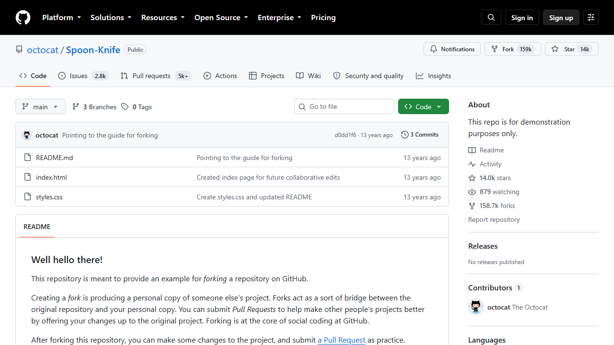
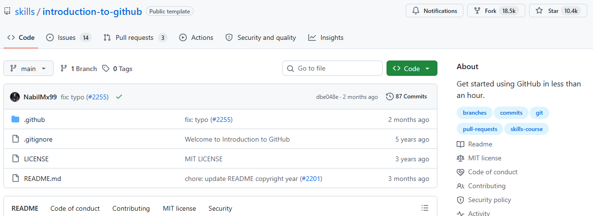
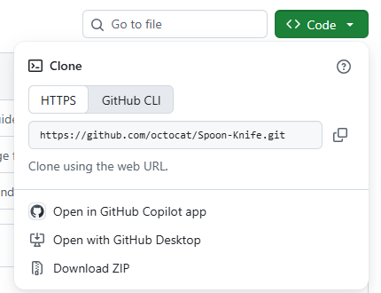
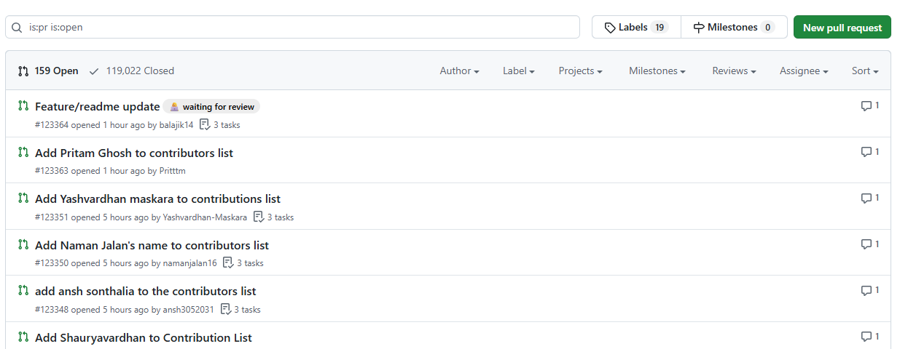
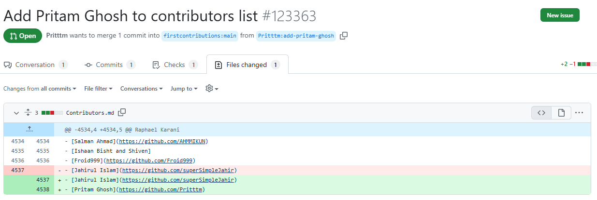

# GitHub-oefening: van clone tot pull request

**Doel:** oefenen met de belangrijkste Git- en GitHub-handelingen: clonen, branches, commits, pushen, pull requests, mergen en merge conflicts.

**Benodigdheden**

* Git geïnstalleerd — <https://git-scm.com/downloads>

* Een GitHub-account — <https://github.com/signup>

* VS Code of een andere editor — <https://code.visualstudio.com/download>

* Een oefenrepository — zie "Waar oefen je op?" hieronder

**Tijdsduur:** ongeveer 30 minuten voor deel 1 tot en met 6. De bonusdelen kosten elk zo'n
15 minuten extra.

## Zo begin je

Klik rechtsboven op **Use this template** en daarna op **Create a new repository**. Je krijgt dan
een eigen kopie van deze oefening onder je eigen GitHub-account, met alle rechten die je nodig hebt
om te mergen en branches te verwijderen. Werk vanaf dat moment in jouw kopie verder, niet in deze
repository: hier kun je niet pushen.

Kun je die knop niet vinden, dan werkt de route in Deel 1b ook: zelf een lege repository aanmaken
via <https://github.com/new>.

Liever op papier? Dezelfde oefening staat als PDF in
[`pdf/`](pdf/GitHub-oefening-van-clone-tot-pull-request.pdf). Die PDF is een momentopname; deze
README is de bron.

## Eerst even dit: Git en GitHub zijn niet hetzelfde

**Git** is het programma op je eigen computer dat bijhoudt wat je in een map verandert. Het werkt
zonder internet en zonder account.

**GitHub** is de website waar je zo'n map online zet, zodat collega's hem kunnen zien, ophalen en
er wijzigingen aan voorstellen.

Een **repository** (kortweg "repo") is één project: een map met bestanden plus de volledige
geschiedenis van alle wijzigingen erin. Die repo staat op twee plekken tegelijk — online op GitHub
en lokaal op je eigen laptop — en met de commando's in deze oefening houd je die twee gelijk.

## Deel 0 — Zo ziet GitHub eruit

Open <https://github.com/octocat/Spoon-Knife> in je browser. Dit is een oefenrepo van GitHub zelf.
Je hoeft er nog niets mee te doen; kijk eerst waar alles staat.



Wat je hier ziet, van boven naar beneden:

| Onderdeel                            | Wat het is                                                                                |
| ------------------------------------ | ----------------------------------------------------------------------------------------- |
| `octocat / Spoon-Knife`              | De eigenaar en de naam van de repository. Samen vormen ze het adres.                      |
| **Fork** (rechtsboven)               | Maakt een eigen kopie van deze repo onder jouw account.                                   |
| **Code / Issues / Pull requests**    | De tabbladen. `Code` zijn de bestanden, `Pull requests` zijn de voorgestelde wijzigingen. |
| **main** (knop met vertakking-icoon) | De branch die je nu bekijkt. `main` is de hoofdversie.                                    |
| **3 Branches**                       | Hoeveel losse werkversies er naast `main` bestaan.                                        |
| Groene knop **Code**                 | Hier haal je het adres vandaan waarmee je de repo naar je laptop kopieert.                |
| De bestandslijst                     | De inhoud van de repo, met per bestand de laatste wijziging.                              |
| **README** eronder                   | Het uitlegbestand. GitHub toont dat automatisch op de voorpagina.                         |

## Waar oefen je op?

Oefen nooit op een repository waar echt werk in staat. Gebruik een eigen lege repository, of een
van de publieke oefenrepo's hieronder. Die zijn er speciaal voor gemaakt: je kunt er niets mee
kapotmaken.

| Repository                                                                         | Waar het voor is                                                                                         | Duur    |
| ---------------------------------------------------------------------------------- | -------------------------------------------------------------------------------------------------------- | ------- |
| **Introduction to GitHub**<https://github.com/skills/introduction-to-github>       | Branch maken, commit, pull request openen en mergen. GitHub begeleidt je stap voor stap in de repo zelf. | < 1 uur |
| **Spoon-Knife**<https://github.com/octocat/Spoon-Knife>                            | Officiële demo-repo van GitHub om forken en pull requests uit te proberen.                               | 15 min  |
| **First Contributions**<https://github.com/firstcontributions/first-contributions> | Je eerste echte pull request naar andermans repository: forken, clonen, branchen, PR terugsturen.        | 30 min  |
| **Hello Git World**<https://github.com/githubtraining/hellogitworld>               | Klassieke trainingsrepo voor branches, wijzigingen en merges. Gearchiveerd, dus alleen lokaal bruikbaar. | vrij    |

**Aanbevolen volgorde:** Introduction to GitHub → Spoon-Knife → First Contributions. Je begint dan
begeleid, oefent daarna zelfstandig het fork-model, en sluit af met een pull request naar een

repository die niet van jou is — precies de situatie die je in het echt tegenkomt.
De begeleide cursus start je door op <https://github.com/skills/introduction-to-github> op de groene
knop **Use this template** te klikken. GitHub maakt dan een kopie onder jouw account die je stap
voor stap door de opdrachten leidt.



De oefening hieronder doe je op je **eigen** nieuwe repository. Dat is bewust: je hebt dan zelf
rechten om te mergen en branches te verwijderen, wat in de repo's van anderen niet kan.

> [!WARNING]
> `githubtraining/hellogitworld` is **gearchiveerd**. Je kunt er wel van clonen en er lokaal in
> werken, maar pushen en pull requests openen gaat niet. Gebruik hem alleen om lokale
> Git-commando's te oefenen, niet voor het GitHub-gedeelte.

## Deel 1a — Eenmalig instellen

Dit doe je één keer per computer. Sla je het over, dan weigert Git later je eerste commit.

* [ ] Open een terminal. Op Windows is dat **Git Bash** (staat na de installatie van Git in je
  startmenu) of **PowerShell**. Op Mac is dat **Terminal**.

* [ ] Controleer of Git er staat:

```bash
git --version
```

Je krijgt een versienummer terug, bijvoorbeeld `git version 2.45.1`. Krijg je "command not
found", dan is Git nog niet geïnstalleerd.

* [ ] Zet je naam en e-mailadres. Deze komen bij elke commit te staan, dus gebruik hetzelfde
  e-mailadres als van je GitHub-account:

```bash
git config --global user.name "Jouw Naam"
git config --global user.email "jouw.naam@wiltec.nl"
```

* [ ] Controleer wat er nu ingesteld staat:

```bash
git config --global --list
```

## Deel 1b — Repository clonen

**Clonen** betekent: de repository van GitHub naar je eigen laptop kopiëren, inclusief de hele
geschiedenis. Je doet dit één keer per repository; daarna werk je lokaal verder.

Heb je bij "Zo begin je" **Use this template** gebruikt? Dan bestaat je eigen repository al. Sla de
eerste twee stappen hieronder over en ga verder bij het kopiëren van de clone-URL.

* [ ] Ga naar <https://github.com/new> en maak een repository aan, bijvoorbeeld `github-oefening`.

* [ ] Zet hem op **Public** en vink **Add a README file** aan. Klik op **Create repository**.

* [ ] Klik op je nieuwe repo op de groene knop **Code**, kies het tabblad **HTTPS** en klik op het
  kopieer-icoon achter de URL.



Je hebt nu een adres in je klembord van de vorm
`https://github.com/<jouw-gebruikersnaam>/github-oefening.git`.

* [ ] Ga in je terminal eerst naar de map waar je het project wilt hebben. Git maakt daar
  vervolgens zelf een submap met de naam van de repo:

```bash
cd ~/Documents
```

* [ ] Clone de repository — plak de URL die je net gekopieerd hebt:

```bash
git clone https://github.com/<jouw-gebruikersnaam>/github-oefening.git
```

De eerste keer vraagt Git om in te loggen bij GitHub. Er opent een venster van je browser; log
daar in en geef toestemming. Daarna onthoudt je computer dat.

* [ ] Ga de nieuwe map in:

```bash
cd github-oefening
```

* [ ] Controleer de status:

```bash
git status
```

Je ziet nu `On branch main` en `nothing to commit, working tree clean`. Dat betekent: je zit op de
hoofdbranch en er zijn geen wijzigingen die nog niet zijn opgeslagen.

**Controle:** je repository staat nu lokaal op je computer. Open de map in je verkenner — je ziet
`README.md` staan, en een verborgen map `.git` waarin Git de geschiedenis bijhoudt. Die map laat
je met rust.

***

## Deel 2 — Een branch maken

Een **branch** is een aparte werkversie van de repo. Je werkt er los in, zonder dat `main` er iets
van merkt, en voegt hem pas samen als je klaar bent. Zo blijft `main` altijd werkend.

* [ ] Bekijk je huidige branches:

```bash
git branch
```

* [ ] Maak een nieuwe branch:

```bash
git switch -c feature/about-me
```

* [ ] Controleer opnieuw:

```bash
git branch
```

**Controle:** je hoort nu op `feature/about-me` te staan.

***

## Deel 3 — Een wijziging maken en committen

* [ ] Open `README.md`.

* [ ] Voeg bijvoorbeeld het volgende toe:

```markdown
## Over mij

Ik gebruik deze repository om Git en GitHub te oefenen.

Mijn leerdoelen:
- werken met branches
- commits maken
- pull requests gebruiken
- merge conflicts oplossen
```

* [ ] Bekijk welke bestanden gewijzigd zijn:

```bash
git status
```

* [ ] Voeg de wijziging toe aan **staging** — de wachtrij van wijzigingen die je in je volgende
  commit wilt hebben. Zo kun je vijf bestanden aanpassen en er maar twee meenemen:

```bash
git add README.md
```

* [ ] Maak een **commit**: een opgeslagen momentopname met een omschrijving erbij. De tekst achter
  `-m` lezen je collega's later terug, dus schrijf op wát je veranderde:

```bash
git commit -m "Add about me section"
```

* [ ] Bekijk je commits:

```bash
git log --oneline
```

***

## Deel 4 — Branch naar GitHub pushen

**Pushen** is je lokale commits naar GitHub sturen. Tot nu toe stond je werk alleen op je eigen
laptop. In het commando hieronder is `origin` de naam die Git aan "de repo op GitHub" geeft, en
zorgt `-u` ervoor dat je de volgende keer kunt volstaan met `git push`.

* [ ] Push je nieuwe branch:

```bash
git push -u origin feature/about-me
```

* [ ] Open daarna je repository op GitHub.

* [ ] Controleer of de branch `feature/about-me` zichtbaar is.

***

## Deel 5 — Pull request maken

Een **pull request** (PR) is het verzoek "neem mijn branch op in `main`". Het is de plek waar een
collega je wijziging bekijkt en er iets van kan vinden voordat hij definitief wordt. Op het
tabblad **Pull requests** van een repo zie je alle openstaande verzoeken:



* [ ] Open je repository op GitHub. Sinds je gepusht hebt staat er een gele balk met **Compare &
  pull request**. Klik daarop. Zie je hem niet, ga dan naar het tabblad **Pull requests** en
  klik op de groene knop **New pull request**.

* [ ] Controleer bovenaan de richting: links `base: main`, rechts `compare: feature/about-me`.
  Dat leest als "voeg feature/about-me toe aan main".

* [ ] Geef de pull request een duidelijke titel, bijvoorbeeld:

```text
Add about me section
```

* [ ] Voeg eventueel een korte beschrijving toe en klik op **Create pull request**.

* [ ] Bekijk het tabblad **Files changed**. Rood met een `-` is weggehaald, groen met een `+` is
  toegevoegd. Zo ziet dat eruit:



* [ ] Klik op **Merge pull request** en daarna op **Confirm merge**.

* [ ] Klik op **Delete branch**. De branch is opgegaan in `main` en heeft geen doel meer.

***

## Deel 6 — Je lokale repository bijwerken

Ga terug naar je terminal.

* [ ] Schakel terug naar `main`:

```bash
git switch main
```

* [ ] Haal de nieuwste wijzigingen van GitHub binnen:

```bash
git pull
```

* [ ] Bekijk het resultaat:

```bash
git log --oneline
```

**Controle:** de wijziging uit je pull request staat nu ook lokaal op `main`.

***

# Bonus — Merge conflict oefenen

Dit deel is iets uitdagender.

## Stap 1

Maak een nieuwe branch:

```bash
git switch -c feature/change-title
```

Wijzig de eerste regel van `README.md`, bijvoorbeeld naar:

```markdown
# Mijn GitHub oefenproject
```

Commit de wijziging:

```bash
git add README.md
git commit -m "Change README title"
```

## Stap 2

Ga terug naar `main`:

```bash
git switch main
```

Wijzig **dezelfde regel** naar iets anders:

```markdown
# Git en GitHub training
```

Commit ook deze wijziging:

```bash
git add README.md
git commit -m "Update README heading"
```

## Stap 3

Probeer nu de branch te mergen:

```bash
git merge feature/change-title
```

Git zal waarschijnlijk een **merge conflict** melden.

Open `README.md`. Je ziet iets dat lijkt op:

```text
<<<<<<< HEAD
# Git en GitHub training
=======
# Mijn GitHub oefenproject
>>>>>>> feature/change-title
```

* [ ] Kies welke tekst je wilt behouden.

* [ ] Verwijder de conflictmarkeringen.

* [ ] Sla het bestand op.

* [ ] Voeg het opgeloste bestand toe:

```bash
git add README.md
```

* [ ] Maak de merge af:

```bash
git commit
```

***

# Bonus — Forken: bijdragen aan een repository die niet van jou is

Tot nu toe werkte je in je eigen repository. Bij de meeste projecten heb je die rechten niet en
werk je met een **fork**: je eigen kopie op GitHub, waaruit je een pull request naar het
origineel stuurt. Oefen dit op `firstcontributions/first-contributions`.

* [ ] Open de repository op GitHub en klik rechtsboven op **Fork**.

* [ ] Clone jouw fork (let op: jouw gebruikersnaam in de URL, niet die van het origineel):

```bash
git clone https://github.com/<jouw-gebruikersnaam>/first-contributions.git
cd first-contributions
```

* [ ] Maak een branch:

```bash
git switch -c add-<jouw-naam>
```

* [ ] Voeg je naam toe aan `Contributors.md`, commit en push:

```bash
git add Contributors.md
git commit -m "Add <jouw naam> to Contributors"
git push -u origin add-<jouw-naam>
```

* [ ] Open op GitHub een pull request van jouw fork naar `firstcontributions/first-contributions`.

**Controle:** je pull request staat in de originele repository en wacht op review. Mergen doe je
hier niet zelf — dat doet de eigenaar van het project.

***

# Eindcontrole

Na deze oefening moet je kunnen uitleggen wat deze commando's doen:

```bash
git clone
git status
git branch
git switch
git add
git commit
git push
git pull
git merge
git log
```

Je hebt daarnaast geoefend met:

* [ ] Repository clonen

* [ ] Branch maken

* [ ] Wijzigingen maken

* [ ] Staging

* [ ] Commits

* [ ] Pushen naar GitHub

* [ ] Pull requests

* [ ] Mergen

* [ ] Merge conflicts oplossen

* [ ] Forken en bijdragen aan een repository van iemand anders

## Extra uitdaging

Probeer daarna dezelfde workflow nog een keer zonder naar deze opdracht te kijken:

```text
Issue
↓
Branch
↓
Code aanpassen
↓
Commit
↓
Push
↓
Pull Request
↓
Review
↓
Merge
↓
Pull
```

# Begrippenlijst

| Begrip                | Wat het betekent                                                                   |
| --------------------- | ---------------------------------------------------------------------------------- |
| **Repository (repo)** | Eén project: een map met bestanden plus de volledige wijzigingsgeschiedenis.       |
| **Clone**             | Een repository van GitHub naar je eigen laptop kopiëren. Doe je één keer per repo. |
| **Branch**            | Een aparte werkversie naast `main`, waarin je kunt werken zonder `main` te raken.  |
| **main**              | De hoofdbranch: de versie die geldt als "zo is het".                               |
| **Staging**           | De wachtrij van wijzigingen die in je volgende commit meegaan (`git add`).         |
| **Commit**            | Een opgeslagen momentopname van je wijzigingen, met omschrijving.                  |
| **Push**              | Je lokale commits naar GitHub sturen.                                              |
| **Pull**              | Wijzigingen van GitHub naar je laptop halen.                                       |
| **origin**            | De naam die Git gebruikt voor "de repository op GitHub".                           |
| **Pull request (PR)** | Het verzoek om je branch in `main` op te nemen, inclusief de review erop.          |
| **Merge**             | Twee branches samenvoegen.                                                         |
| **Merge conflict**    | Twee mensen wijzigden dezelfde regel; Git kan niet kiezen en vraagt het jou.       |
| **Fork**              | Je eigen kopie op GitHub van andermans repository, om vanuit te kunnen bijdragen.  |

# Waar je verder kunt kijken

* Officiële GitHub-documentatie in het Nederlands: <https://docs.github.com/nl>

* Alle GitHub Skills-cursussen: <https://skills.github.com>

* Naslag van alle Git-commando's: <https://git-scm.com/docs>

* Overzichtelijke spiekbrief (PDF): <https://education.github.com/git-cheat-sheet-education.pdf>

